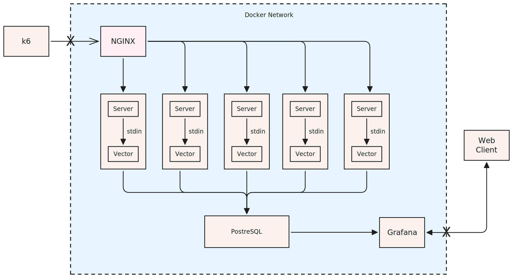

# Log-First Observability POC

A proof-of-concept demonstrating how meaningful observability signals can be extracted from high-volume, high-cardinality logs.

## Architecture



Traffic flows from the k6 load generator through Nginx to Bun HTTP servers. Servers emit structured JSON logs that Vector ingests, and forwards to PostgreSQL for storage and analytics. Grafana provides dashboards for visualization.

## Quick Start

```bash
docker compose up --build
```

The services will start on the ports below. Once running, generate load with k6:

```bash
k6 run ./k6/load.js
```

## Services

| Service | Port | Description |
|---------|------|-------------|
| API     | 3000 | Nginx load-balanced Bun HTTP servers |
| Grafana | 3001 | Dashboards and log analytics |

## Endpoints

- `GET /health` — Health check
- `GET /items/:id` — Simulated read path with variable latency
- `POST /items` — Simulated write path with validation
- `GET /fanout` — Simulated downstream service calls

## Grafana

Open http://localhost:3001 and import the dashboard to see:

- Requests per second (TPS)
- Error rates
- P95 latency
- Requests by route

## Tech Stack

- **Bun** — HTTP server runtime
- **Vector** — Log ingestion and filtering
- **PostgreSQL** — Log storage
- **Nginx** — Load balancing
- **Grafana** — Visualization
- **k6** — Load testing

## License

MIT

